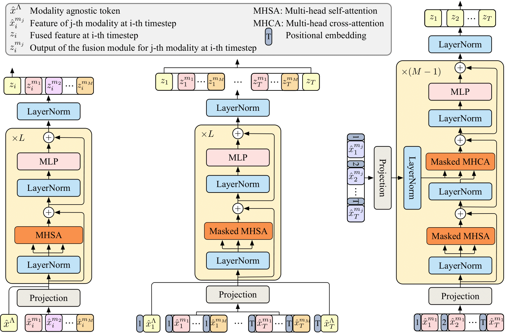

# Anticipative Feature Fusion Transformer for Multi-Modal Action Anticipation (WACV 2023)
[](https://paperswithcode.com/sota/action-anticipation-on-epic-kitchens-100?p=anticipative-feature-fusion-transformer-for) <br/>

This repository contains the official source code and data for 
our [AFFT](https://arxiv.org/abs/2210.12649) paper. 
If you find our code or paper useful, please consider citing:

Z. Zhong, D. Schneider, M. Voit, R. Stiefelhagen and J. Beyerer. 
**Anticipative Feature Fusion Transformer for Multi-Modal Action Anticipation.** 
arXiv preprint arXiv:2210.12649, 2022.

```bibtex
@article{zhong2022afft,
  title={Anticipative Feature Fusion Transformer for Multi-Modal Action Anticipation},
  author={Zhong, Zeyun and Schneider, David and Voit, Michael and Stiefelhagen, Rainer and Beyerer, J{\"u}rgen},
  journal={arXiv preprint arXiv:2210.12649},
  year={2022}
}
```

<div style="text-align:center">

</div>

## Installation
First clone the repo and set up the required packages in a conda environment.

```bash
$ git clone https://github.com/zeyun-zhong/AFFT.git
$ conda env create -f environment.yaml python=3.7
$ conda activate afft
```

## Download Data
### Dataset features

AFFT works on pre-extracted features, so you will need to download the features first. You can
download the TSN-features from RULSTM for [EK100](https://github.com/fpv-iplab/rulstm/blob/master/RULSTM/scripts/download_data_ek100_full.sh)
and for [EGTEA Gaze+](https://iplab.dmi.unict.it/sharing/rulstm/features/egtea.zip).
The RGB-Swin features are available [here](https://cvhci.anthropomatik.kit.edu/~dschneider/epic-kitchens/features/rgb_omnivore.zip) and audio features are available [here](https://cvhci.anthropomatik.kit.edu/~dschneider/epic-kitchens/features/audio.zip).

Please make sure that your data structure follows the structure shown below. Note that 
`dataset_root_dir` in [config.yaml](conf/config.yaml) should be changed to your specific data path.

```
Dataset root path (e.g., /home/user/datasets)
├── epickitchens100
│   └── features
│       │── rgb
│       │   └── data.mdb
│       │── rgb_omnivore
│       │   └── data.mdb
│       │── obj
│       │   └── data.mdb
│       │── audio
│       │   └── data.mdb
│       └── flow
│           └── data.mdb
└── egtea
    └── features
        │── TSN-C_3_egtea_action_CE_s1_rgb_model_best_fcfull_hd
        │   └── data.mdb
        │── TSN-C_3_egtea_action_CE_s1_flow_model_best_fcfull_hd
        │   └── data.mdb
        │── TSN-C_3_egtea_action_CE_s2_rgb_model_best_fcfull_hd
        │   └── data.mdb
        │── TSN-C_3_egtea_action_CE_s2_flow_model_best_fcfull_hd
        │   └── data.mdb
        │── TSN-C_3_egtea_action_CE_s3_rgb_model_best_fcfull_hd
        │   └── data.mdb
        └── TSN-C_3_egtea_action_CE_s3_flow_model_best_fcfull_hd
            └── data.mdb
```

If you use a different organization, you would need to edit `rulstm_feats_dir` in [EK100-common](conf/dataset/epic_kitchens100/common.yaml)
and [EGTEA-common](conf/dataset/egtea/common.yaml).

### Model Zoo

| Dataset | Modalities                                               | Performance <br/> (Actions)                     | Config                                                                                                                                  | Model     |
|---------|:---------------------------------------------------------|-------------------------------------------------|-----------------------------------------------------------------------------------------------------------------------------------------|-----------|
| EK100   | R-Swin, O, AU, F <br/> R-TSN, O, AU, F <br/> R-TSN, O, F | 18.5 (MT5R) <br/> 17.0 (MT5R) <br/> 16.4 (MT5R) | `expts/01_SA-Fuser_ek100_val_Swin.txt` <br/> `expts/01_SA-Fuser_ek100_val_TSN.txt` <br/> `expts/01_SA-Fuser_ek100_val_TSN_wo_audio.txt` | [link](https://fraunhofer-my.sharepoint.com/:f:/g/personal/zeyun_zhong_iosb_fraunhofer_de/Elr_Rj8NyopLuxIsMsw_nh4BAbhqWwSt3oC6vdRjngx3rw?e=fgvULq) <br/> [link](https://fraunhofer-my.sharepoint.com/:f:/g/personal/zeyun_zhong_iosb_fraunhofer_de/Eur99IeJJepNgRtlx8JVjzgBg2c94kDtb8iQXBpS8lINqg?e=CRgROp) <br/> [link](https://fraunhofer-my.sharepoint.com/:f:/g/personal/zeyun_zhong_iosb_fraunhofer_de/EmpcaPNHINZPvpGDRtHDLksB4UGMnJW99x45la6f_Ke0DA?e=EwBXWV) |
| EGTEA   | RGB-TSN, Flow                                            | 42.5 (Top-1)                                    | `expts/02_ek100_avt_tsn.txt`                                                                                                            | [link](https://fraunhofer-my.sharepoint.com/:f:/g/personal/zeyun_zhong_iosb_fraunhofer_de/Euw6iM-bGOtAhSq1w4D80KsBnEUIphx85wtYHKicRvFgcA?e=8U3fdF)  |


## Training
Recall that `dataset_root_dir` in [config.yaml](conf/config.yaml) should be changed to your specific path. 
>### EpicKitchens-100
> ```bash
> python run.py -c expts/01_SA-Fuser_ek100_train.txt --mode train --nproc_per_node 2
>```

>### EGTEA Gaze+
> ```bash
> python run.py -c expts/06_SA-Fuser_egtea_train.txt --mode train --nproc_per_node 2
>```

## Validation
>### EpicKitchens-100
> ```bash
> python run.py -c expts/01_SA-Fuser_ek100_val_TSN_wo_audio.txt --mode test --nproc_per_node 1
>```

>### EGTEA Gaze+
> ```bash
> python run.py -c expts/06_SA-Fuser_egtea_val.txt --mode test --nproc_per_node 1
>```

## Test / Challenge (EK100)
> ```bash
> # save logits
> python run.py -c expts/01_SA-Fuser_ek100_test_TSN_wo_audio.txt --mode test --nproc_per_node 1
> 
> # generate test / challenge file
> python challenge.py --prefix_h5 test --models fusion_ek100_tsn_wo_audio_4h_18s --weights 1.
>```


## License

This codebase is released under the license terms specified in the [LICENSE](LICENSE) file. Any imported libraries, datasets or other code follows the license terms set by respective authors.


## Acknowledgements

Many thanks to [Rohit Girdhar](https://github.com/facebookresearch/AVT) and [Antonino Furnari](https://github.com/fpv-iplab/rulstm) for providing their code and data.
